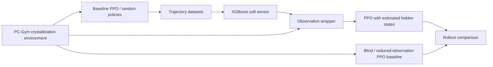

# Crystallization control with partial observations, DRL, and machine learning

This project studies temperature control of a simulated crystallization process when some process states are unavailable to the controller. It combines:

- **PC-Gym** for the crystallization process simulation;
- **PPO** (Proximal Policy Optimization) for control policies;
- **XGBoost** soft sensors that estimate hidden process variables; and
- a comparison with a controller that has reduced observations but no soft-sensor reconstruction.

The work is organized as Jupyter notebooks. Pre-generated datasets, trained XGBoost models/scalers, and several baseline PPO checkpoints are included, so the partial-observation experiments can be explored without regenerating every upstream artifact.



## Process and experiment design

Each simulated episode is 30 minutes long with 30 one-minute control intervals. The action is an incremental temperature change in the range `[-1, 1]`. The environment tracks particle-moment states (`mu0`–`mu3`), concentration (`C`), coefficient of variation (`CV`), and mean crystal size (`Ln`). The control objective is to track constant targets `CV = 1.0` and `Ln = 15.0`.

The collected dataset schema is:

| Column | Meaning |
| --- | --- |
| `mu0`, `mu1`, `mu2`, `mu3` | Crystal-size-distribution moments |
| `C` | Solute concentration |
| `CV` | Coefficient of variation |
| `Ln` | Mean crystal size |
| `CV_SP`, `Ln_SP` | Setpoints used by the controller |

Two partial-observation cases are included:

| Variant | Hidden/reconstructed variables | Soft-sensor inputs | Notebooks |
| --- | --- | --- | --- |
| `hide1` | `mu3` | `mu0`, `mu1`, `mu2`, `C`, `CV`, `Ln`, and setpoints | `ml-training/hide1/`, `drl-training/hide1/` |
| `hide2` | `mu3` and `C` | `mu0`, `mu1`, `mu2`, `CV`, `Ln` | `ml-training/hide2/`, `drl-training/hide2/` |

For each case there is a standard XGBoost model and a temporal-window model. Window models use the current state plus the preceding five samples (a six-sample history).

## Repository layout

```text
dataset-generation/
  gen-data.ipynb                   # Generate random- and PPO-policy trajectories
  *.csv                             # Generated trajectory datasets
drl-compare/
  crystallization_default*.ipynb    # Full-state PPO baselines
  crystallization_hide*.ipynb       # Reduced-observation (blind) baselines
  ppo-default-*.zip                 # Saved baseline policies
ml-training/
  hide1/, hide2/                    # XGBoost soft-sensor training notebooks and artifacts
drl-training/
  hide1/, hide2/                    # PPO training with soft-sensor observation wrappers
```

## Setup

Use Python 3.10 or 3.11 in a fresh virtual environment. From the repository root:

```bash
python3 -m venv .venv
source .venv/bin/activate
python -m pip install --upgrade pip
python -m pip install pcgym stable-baselines3 xgboost scikit-learn \
  pandas numpy matplotlib seaborn jupyterlab joblib tqdm optuna pygame
```

The notebooks use PC-Gym's JAX integration. If the environment reports that JAX is unavailable, install the CPU build as well:

```bash
python -m pip install "jax[cpu]"
```

Launch Jupyter from the directory containing the notebook you plan to run. This keeps the notebooks' relative paths predictable; for example:

```bash
cd ml-training/hide2
jupyter lab
```

## Run an existing experiment

The quickest useful run is the `hide2` windowed soft-sensor experiment, because its trained model artifacts and source data are already committed.

1. From the repository root, run `cd ml-training/hide2 && jupyter lab`; then open `ml_2_window.ipynb` and run all cells to train/evaluate the windowed XGBoost estimator. It writes `xgb_window_2.json`; the required scalers are already present as `X_scaler_2.pkl` and `y_scaler_2.pkl`.
2. Start a new Jupyter session with `cd drl-training/hide2 && jupyter lab`, then open `PPO_training_window_2.ipynb`.
3. In the `CrystalObservationWrapper(...)` construction cell, replace the Colab-only `/content/...` paths with paths relative to that notebook directory:

   ```python
   env = CrystalObservationWrapper(
       env=env,
       X_scaler_path="../../ml-training/hide2/X_scaler_2.pkl",
       y_scaler_path="../../ml-training/hide2/y_scaler_2.pkl",
       xgb_model_path="../../ml-training/hide2/xgb_window_2.json",
   )
   ```

4. Run the environment, wrapper, PPO-training, and evaluation cells in order. The configured training length is `22_000` PPO timesteps, and the policy is saved as `ppo-partial-2-<timesteps>.zip` in the notebook's working directory.

To use the non-window version, use `ml-training/hide2/ml_2.ipynb` and `drl-training/hide2/PPO_training_2.ipynb`, changing only the model path to `../../ml-training/hide2/xgb_2.json`.

## Reproduce the full pipeline

Run the notebooks in this order. Execute cells in their displayed order; several notebooks define wrappers and evaluators in earlier cells.

1. **Train full-observation PPO baselines (optional when using the committed checkpoints).**
   - `drl-compare/crystallization_default_500.ipynb` creates a short 500-step baseline.
   - `drl-compare/crystallization_default.ipynb` creates a longer baseline (the current notebook config uses 35,000 steps).
2. **Collect trajectories.** Open `dataset-generation/gen-data.ipynb` and run either the random-policy collector or PPO-policy collector. Set `model_path` to the baseline checkpoint to use. The collectors write CSV files into `dataset-generation/`.
3. **Train a soft sensor.** Choose one of:
   - `ml-training/hide1/ml.ipynb` or `ml-training/hide1/ml_window.ipynb` for `mu3` reconstruction;
   - `ml-training/hide2/ml_2.ipynb` or `ml-training/hide2/ml_2_window.ipynb` for joint `mu3`/`C` reconstruction.
4. **Train PPO with estimated observations.** Run the matching notebook under `drl-training/hide1/` or `drl-training/hide2/`.
5. **Compare against baselines.** Use `drl-compare/crystallization_hide.ipynb` or `drl-compare/crystallization_hide2.ipynb` for reduced-observation PPO experiments, and inspect the rollout plots/reward summaries produced by PC-Gym.

The standard ML notebooks concatenate these three 5,000-episode datasets:

```text
dataset-generation/cryst-unnormalized-5000ep-ppo-default-500.csv
dataset-generation/cryst-unnormalized-5000ep-ppo-default-30000.csv
dataset-generation/cryst-unnormalized-5000ep-random.csv
```

Each has 145,000 saved states. Regenerating all of them is therefore substantially more expensive than running a single PPO experiment.

## Notebook path notes

Some notebooks were authored in Google Colab or before the current folder layout. Update hard-coded paths before running them locally:

| Notebook | Change needed |
| --- | --- |
| `drl-training/hide1/PPO_training.ipynb` | Point its scaler/model arguments to `../../ml-training/hide1/` (`X_scaler.pkl`, `y_scaler.pkl`, and `xgb_model.ubj` or the model you trained). |
| `drl-training/hide1/PPO_training_window.ipynb` | Replace `/content/...` with `../../ml-training/hide1/` paths; use `xgb_window_opt.json` or `xgb_window.json`. |
| `drl-training/hide2/PPO_training_2.ipynb` | Replace `/content/...` with `../../ml-training/hide2/` paths; use `xgb_2.json`. |
| `drl-training/hide2/PPO_training_window_2.ipynb` | Replace `/content/...` with `../../ml-training/hide2/` paths; use `xgb_window_2.json`. |
| `ml-training/hide1/*.ipynb` | Update dataset reads from `../dataset-generation/...` to `../../dataset-generation/...` when running from the notebook directory. |

The wrapper implementations currently live inside the DRL notebooks rather than as importable Python modules. Keep the wrapper-definition cell and the PPO-training cell in the same kernel session.

## Included artifacts

- `dataset-generation/`: normalized and unnormalized trajectory datasets, including random-policy and PPO-policy collections.
- `ml-training/hide1/` and `ml-training/hide2/`: XGBoost JSON/UBJ models and fitted `MinMaxScaler` objects.
- `drl-compare/ppo-default-500.zip`, `ppo-default-30000.zip`, and `ppo-default-35000.zip`: full-observation PPO checkpoints loadable with `PPO.load(...)`.

## Notes for reproducibility

- Process noise is enabled at 1% (`noise=True`, `noise_percentage=0.01`), so results can vary between runs unless seeds are set consistently.
- The ML train/test split uses `random_state=42`; PPO notebooks do not consistently set a seed.
- The environment and PPO hyperparameters are defined near the top of each notebook. Record changes to those cells alongside any reported result.
